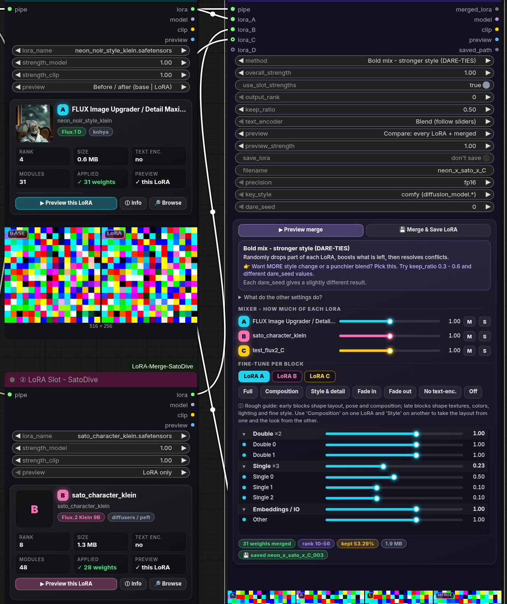
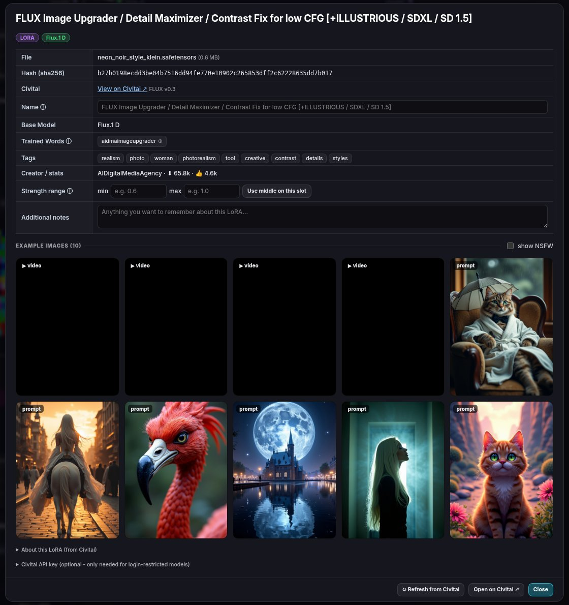
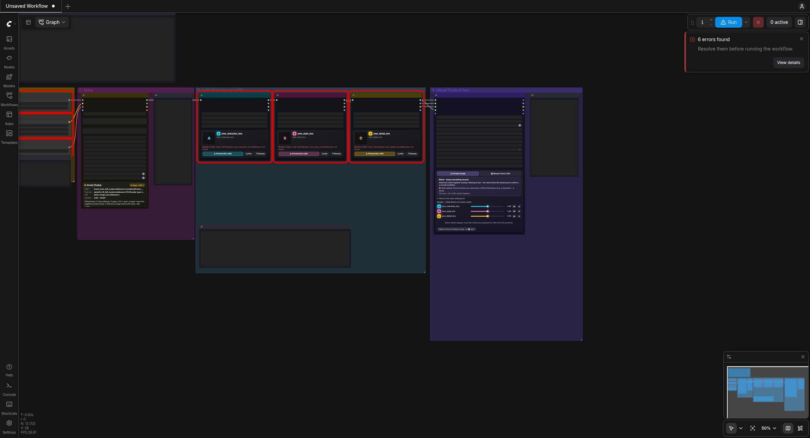

# LoRA Merge Studio - SatoDive  (v2)

A ComfyUI node pack for inspecting, previewing and merging LoRAs. Preview every LoRA on its own, mix **2 to 10 LoRAs**, and save the result as a brand-new LoRA.

## What's new in v2

* **Every LoRA slot shows its own LoRA.** Before each preview the model is reloaded (`isolated_previews`, on by default). That way no slot can show the base model or another slot's LoRA, whatever your GPU/VRAM mode. Each slot also shows **Applied ✓ N weights**, so you can see that the LoRA really changes the model.
* **Merge any number of LoRAs.** Connect a LoRA Slot to the Merge Studio and a new `lora_…` input appears, up to 10.
* **Plain-language help.** The merge methods have names that say what they do. A guide card explains the method you picked ("👉 Want MORE style change? Pick this…"), and every setting has a tooltip.
* **Mixer with Mute / Solo** for each LoRA, plus **per-block sliders per LoRA**. Block presets include *Composition*, *Style & detail*, *Fade in/out* and *No text-enc.*
* **Civitai info dialog**, like Power LoRA Loader's ⓘ: pictures and videos, base model, trigger words (click **⊕** to add one to the prompt), tags, creator and stats. You can also save your own **name, strength range and notes** for each LoRA.
* **🔎 LoRA browser:** a picture gallery with search, an architecture filter and an NSFW blur toggle. One button fetches Civitai info for all your LoRAs.
* **Presets checked against the official ComfyUI templates** (ComfyUI v0.38). Qwen-Image 2.1 is now 25 steps / CFG 1. There are new presets for **Z-Image Base** and **Flux.2 Klein 9B Base**.
* **7 ready workflows** with colored groups and a guide note beside every step.

## The nodes

| Node | What it does |
|---|---|
| **① LoRA Studio Setup** | Connect the native *Load Diffusion Model*, *Load CLIP* and *Load VAE* nodes, then pick the architecture. Steps, CFG, sampler and shift are filled in from the official templates. It warns you if the loaded model doesn't match. There's an optional reference image for edit models. |
| **② LoRA Slot** (add as many as you want) | One LoRA each, shown on a card: picture, rank, size, text-encoder part, applied weights and trigger words. **▶ Preview this LoRA** runs only this node. You can choose *Before / after* to see the base model next to the LoRA. **ⓘ Info** opens the Civitai dialog and **🔎 Browse** opens the gallery. |
| **④ LoRA Merge Studio** | Method, mixer, per-block sliders, previews (*Merged*, *Compare every LoRA + merged*, *Before/after*), and **💾 Merge & Save LoRA**, which writes `models/loras/SatoDive/<name>_###.safetensors` and never overwrites. Its `merged_lora` output can feed another Merge Studio. |

The old *Slot A / Slot B / 2-LoRA Merge Studio* nodes still load in v1 workflows. They are marked legacy and hidden from search.

## Which merge method?

| Method | Use it when |
|---|---|
| **Blend - keep everything (exact)** | Default. Every LoRA keeps its full power, like stacking them in a workflow. |
| **Blend - smaller file (SVD)** | You want a smaller file to share. Look at "kept %": above ~95% looks the same. |
| **Smart blend - fix conflicts (TIES)** | The mix looks muddy, washed out, or like the LoRAs are fighting. |
| **Bold mix - stronger style (DARE-TIES)** | You want **more style change** or a punchier blend. Try keep_ratio 0.3-0.6. |
| **Soft mix - gentle blend (DARE)** | You want a subtle, painterly mix of styles. |
| **Strongest wins - max impact** | The strongest features of each LoRA should dominate. |

**Per-block tip:** early blocks roughly shape layout, pose and composition, and late blocks shape colors, textures and fine style. For the layout of one LoRA and the look of another, set **Composition** on one tab and **Style & detail** on the other.

## Architectures

| Preset | CLIPLoader type | Settings |
|---|---|---|
| Krea2 (Turbo) | `krea2` | 8 steps, CFG 1, euler/simple (official) |
| Krea2 Raw (Base) | `krea2` | 30 steps, CFG 4 (starting point, no official template yet) |
| Z-Image Turbo | `lumina2` | 8 steps, CFG 1, res_multistep, shift 3 (official) |
| Z-Image Base | `lumina2` | 25 steps, CFG 4, res_multistep, shift 3 (official) |
| Flux.2 Klein 9B | `flux2` | 4 steps, CFG 1, Flux2 schedule (official) |
| Flux.2 Klein 9B Base | `flux2` | 20 steps, CFG 5, Flux2 schedule (official) |
| Qwen-Image 2.1 (Edit) | `qwen_image` | 25 steps, CFG 1, euler/simple. Native 2.1 edit encoder (official) |
| Auto-detect / Other | any | generic |

LoRAs are matched to the model through ComfyUI's own LoRA key maps. So kohya, diffusers/PEFT and comfy-format LoRAs can be mixed freely, including LoRAs that target fused qkv / gate_up weights.

## Civitai

* The lookup uses the file's SHA256, which is computed once and then cached. The info is cached too, and pictures load through ComfyUI and are stored on disk. Everything lives in `ComfyUI/user/satodive_lora_merge/`, never next to your models.
* Images or info saved next to a LoRA by other tools are used too: `name.preview.png`, `name.png`, `name.civitai.info`.
* A Civitai API key is optional (only needed for login-restricted models). You can set it in the info dialog or with the `CIVITAI_API_KEY` environment variable.

## Install

1. Unzip into `ComfyUI/custom_nodes/` so you get `ComfyUI/custom_nodes/ComfyUI-LoRA-Merge-SatoDive/`.
2. Restart ComfyUI and refresh the browser.
3. Open a workflow from `example_workflows/` and pick your own model and LoRA files.

No extra Python packages are needed. It needs a recent ComfyUI with Krea2, Qwen-Image 2.1 and Flux2 support (tested on v0.38.0, frontend 1.53.10).

