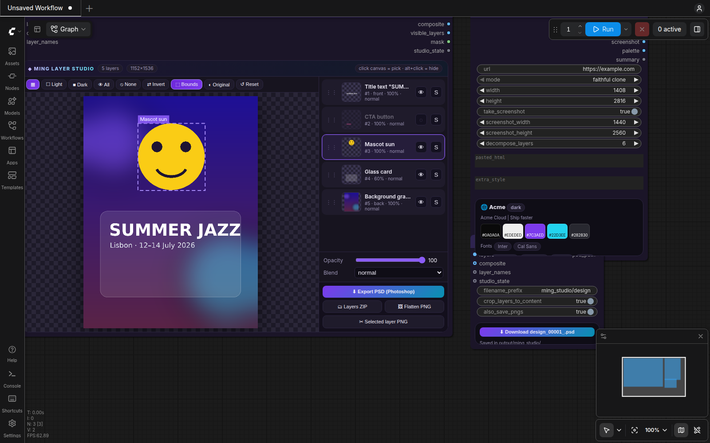

# ◆ ComfyUI Ming Studio

A ComfyUI node pack for **Ming-Image 0.1** from inclusionAI (Ant Group). Ming-Image is an open 6B model family built for graphic design.

- **Ming-Image-0.1-Design** generates UI screens, landing pages, posters, infographics and text-heavy layouts. It can output **real RGBA transparency** and supports **image editing with up to several reference images**.
- **Ming-Image-0.1-Design-Layer** takes a flattened design and splits it into **independent transparent layers**.

Ming Studio adds:

- an interactive **Layer Studio** UI inside the node
- **real Photoshop PSD export** with named, transparent, cropped layers
- a **Website → Design** node that reads a URL and recreates, restyles or layers the page
- seven ready-made workflows

Models load through **ComfyUI's own native nodes**: *Load Diffusion Model*, *Load CLIP* and *Load VAE*.



---

## Install

1. Update ComfyUI to a version with native Ming-Image support (merged Sept 24 2026, v0.37.3 or newer).
2. Unzip this folder into `ComfyUI/custom_nodes/ComfyUI-Ming-Studio`.
3. Restart ComfyUI. The workflows appear under **Templates → Custom nodes → ComfyUI-Ming-Studio**. They are also in `example_workflows/`.

No extra Python packages are required. Optional extra for real website screenshots:

```bash
pip install playwright && playwright install chromium
```

Without Playwright, the website node uses a locally installed Chrome, Edge or Chromium in headless mode. If neither is found, it draws a schematic wireframe of the page instead.

## Models

From [huggingface.co/Comfy-Org/Ming-Image](https://huggingface.co/Comfy-Org/Ming-Image):

| File | Folder | Used for |
|---|---|---|
| `ming_image_0.1_design_int8_convrot.safetensors` (or `_bf16`) | `models/diffusion_models` | text-to-design, editing |
| `ming_image_0.1_design_layer_int8_convrot.safetensors` (or `_bf16`) | `models/diffusion_models` | layer decomposition |
| `ming_image_0.1_ling_mini_2.0_int8_convrot.safetensors` | `models/text_encoders` | text/vision encoder (both models) |
| `ming_image_vae_bf16.safetensors` | `models/vae` | 4-channel RGBA VAE |
| *optional* `qwen3.8_27b_w4a8.safetensors` ([Comfy-Org/Qwen3.8-27B](https://huggingface.co/Comfy-Org/Qwen3.8-27B)) | `models/text_encoders` | prompt enhancer (workflow 06) |

Load CLIP: pick the Ming text encoder. The type is auto-detected; the workflows use `qwen_image`, as the official template does.

## Workflows

| # | Workflow | What it does |
|---|---|---|
| 01 | **Text → Design (RGBA)** | The Prompt Builder writes Ming's native JSON caption, then the Design model generates the image and saves it as an RGBA PNG. |
| 02 | **Image → Layers → PSD Studio** | Load any flat design and decompose it into N layers. Inspect and edit them in Layer Studio, then export a PSD. |
| 03 | **Website → Redesign** | Paste a URL. The node extracts structure, palette and fonts, and Ming builds a clone, redesign, dark mode, mobile app, wireframe or ad from them. |
| 04 | **Website → Layered PSD** | Screenshot a website, decompose it into layers using an auto-built layer plan, then export a PSD. |
| 05 | **Edit / Restyle / Multi-reference** | Edit a design with instructions. Use up to 4 reference images (for example, "put the logo from image 2 on image 1"). |
| 06 | **Prompt Enhancer Pro** | The official Ming rewriter system prompt runs on a native *Generate Text* LLM, which turns a short request into a precise layered JSON caption. |
| 07 | **Text → Layered PSD** | One brief becomes a design, the design becomes editable layers, and the layers become a Photoshop file, all in one graph. |

Recommended settings (from the Ming authors):

- **Design:** 12 steps, CFG 1.0, buckets 1024 or 2048 (2048 recommended).
- **Layer:** 12 steps, CFG 2.0, buckets 512 or 1024.
- **Sampling:** ModelSamplingFlux(1.15, 0.5, width, height), euler, simple. This matches the official ComfyUI template.

## Nodes

| Node | Purpose |
|---|---|
| ◆ **Ming Canvas Size** | Empty Ming latent on the official resolution buckets (aspect 1:4 to 4:1) with presets: landing page, mobile, story, banner, poster… |
| ◆ **Ming Design Prompt Builder** | Turns simple fields (type, style, brand, headline, CTA, items, visual, palette) into Ming's Figma-style `canvas_settings` + `layers` JSON with coordinates. Includes 14 design types, 12 styles, custom layers (`desc \| cx,cy,w,h \| #hex`) and a transparent-background toggle. |
| ◆ **Ming Transparent (RGBA) Trigger** | Appends one of the 10 official phrases that switch on a real alpha channel. |
| ◆ **Ming Prompt Enhancer Instructions** | The official text-to-image and layer rewriter prompts, ready for the native *Generate Text* node. |
| ◆ **Ming Prompt Cleanup** | Strips `<think>` blocks and code fences from LLM output, re-formats the JSON and counts layers. |
| ◆ **Ming Layer Decompose Encode** | Builds the Design-Layer conditioning. The image is seen by the encoder and added as a clean reference frame. Produces the composite + N layer latent and a zeroed-text negative (same as the reference pipeline). Accepts a layer plan or a full prompt. |
| ◆ **Ming Edit / Reference Encode** | Edit and multi-reference conditioning with bucket sizing. |
| ◆ **Ming Decode Layers (RGBA)** | Decodes every latent frame separately and returns the composite, RGBA layers (front-most first) and alpha masks. |
| ◆ **Ming Layer Studio** | Interactive UI, described below. |
| ◆ **Ming Save PSD (Photoshop)** | Writes a layered PSD: named layers (Unicode), visibility, opacity, blend modes, tight bounds, RLE compression and a merged preview. It can also save per-layer PNGs and adds a download button on the node. |
| ◆ **Ming RGBA → RGB + Alpha** / **RGB + Mask → RGBA** | Bridges between RGBA images and regular ComfyUI nodes. |
| ◆ **Ming Website → Design** | URL or pasted HTML in. Outputs a design prompt, a decompose prompt, a screenshot, a palette swatch image and a JSON summary. A card on the node shows the palette (click a swatch to copy its hex), fonts, nav and CTAs. |

## Layer Studio

- **Pick:** click the canvas and the top-most opaque layer under the cursor is selected, with its bounds outlined. **Alt + click** hides that layer.
- **Hide / show / solo** each layer, or use **All / None / Invert** for every layer at once.
- **Reorder** by dragging rows. **Rename** by double-clicking a name; names are pre-filled from the layer plan.
- Set **opacity** and **blend mode** (16 Photoshop modes, previewed live).
- **Stage background:** checker, light or dark. Hold **◐ Original** to compare against the model's composite.
- **Export directly from the node** without re-running the graph: **PSD**, **layers ZIP**, **flattened PNG** or **selected layer PNG**. Files go to `output/ming_studio/` and download automatically.
- Re-queue to send your choices to the node outputs: composite of visible layers, visible-layer batch, mask, and `studio_state`. Connect `studio_state` to **Save PSD** to keep your order, names and visibility in the saved file.

## Tips

- Text renders best when it is **quoted** in the caption, and each string should appear **once**. The prompt builder handles this for you.
- Layer plans should list the **front layer first** and the **background last**. Put text in front, give the card behind the text its own layer, and give the main subject its own layer.
- Blocked, logged-in or JavaScript-only website? Paste the page HTML into `pasted_html`, or screenshot it yourself and use workflow 02.
- Low VRAM: use the int8 files, bucket 1024 for designs and 512 for layers.

## Credits

- [Ming-Image](https://github.com/inclusionAI/Ming-Image) by inclusionAI (MIT). The rewriter prompts in `ming_studio/prompts/` and the resolution buckets are taken from that repository.
- Native ComfyUI Ming support by the ComfyUI team.
